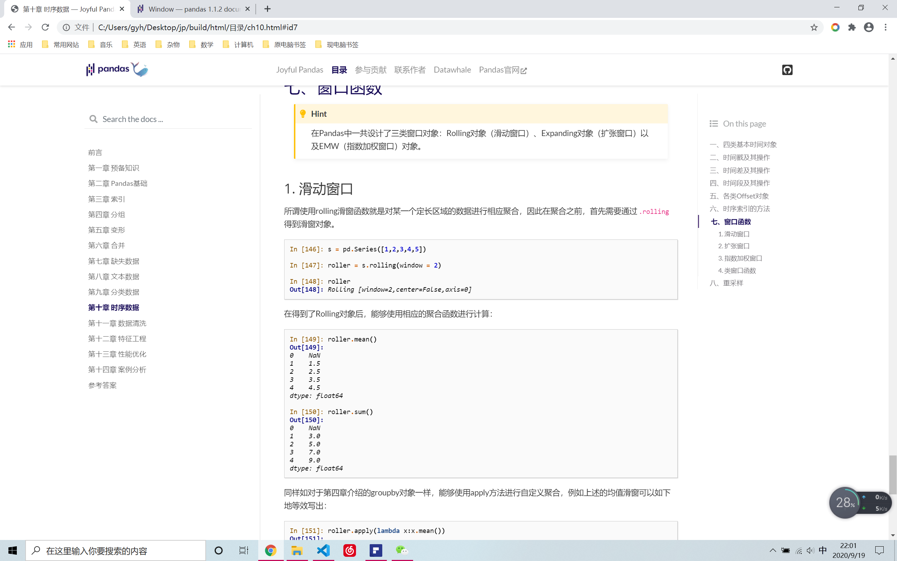

# Joyful-Pandas

【注意！】使用教程前请务必将Pandas升级到[最新版本](https://github.com/pandas-dev/pandas/releases)，否则可能会有代码运行报错！

#### 一、写作初衷

在使用Pandas之前，几乎所有的大型表格处理问题都是用xlrd/xlwt和python循环实现，虽然这已经几乎能完成一切的需求，但其缺点也显而易见，其一就是速度问题，其二就是代码的复用性几乎为0。

曾经也尝试过去零星地学Pandas，但不得不说这个包实在太过庞大，每次使用总觉得盲人摸象，每个函数的参数也很多，学习的路线并不是十分平缓。如果你刚刚上手使用Pandas，那么在碎片的学习过程中，报错是常常发生的事，并且很难修（因为不理解内部的操作），即使修好了下次又不会，令人有些沮丧。

2019秋季，我偶然找到了一本完全关于Pandas的书，Theodore Petrou所著的Pandas Cookbook，现在可在网上下到pdf，不过现在还没有中文版。寒假开始后，立即快速地过了一遍，发现之前很多搞不清的概念得到了较好的解答，逐步地再对着User Guide一字一句查看，最后总算是建立了大的一些宏观概念。

最关键的一步，我想是通读了官方User Guide的绝大部分内容，这可能是非常重要的一个台阶，毕竟官方的教程总是会告诉你重点在哪里。因此，经过了一段时间的思考，结合了Wes Mckinney（Pandas之父）的[Python for Data Analysis](<http://93.174.95.29/_ads/A3AD6E6B2504B95EC39A6C57D465BA5D>)、先前提到的[Pandas Cookbook](<http://93.174.95.29/_ads/23950B4446ABB5DD27168D6B0FB2C8DB>)和官方的[User Guide](<https://pandas.pydata.org/docs/user_guide/index.html#user-guide>)，由此想按照自己的思路编一套关于Pandas的教程，完整梳理Pandas的主线内容，杜绝浅尝辄止，保证涉及每个部分的核心概念和函数。最后，希望达到的境界自然是“所写所得即所想”，这大概需要更多的实践，也是努力实现的目标方向。

关于项目的名字，我想原先使用Pandas时非常的痛苦（Painful），那现在是时候转变为“Joyful-Pandas”了！

#### 二、编排思路

本项目共有十章，可以大致分为4个板块：Pandas基础、四类操作、四类数据、例子。

1、拿到数据必然先要读取它，分析完了数据必然是要保存它，读取了数据之后，我们面对了怎样的对象（Series? or Dataframe?）是第一重要的课题，因此了解序列和数据框的常规操作及其组件（component）便是必须涉及的内容。

2、对于一个DataFrame而言，如果一个操作使得它的元素信息减少了，那就对应了索引，即第二章的内容；如果这个操作使得数据的信息被充分地使用，那有两种可能，第一是数据被分组，从组内提取了关键的信息，第二就是数据呈现的结构或形态上的变化，使得我们更容易地能够地进一步处理数据，这两者分别对应了第三章与第四章的内容；最终如果一个操作使得原本不属于这个数据框的信息被加入了进来，那往往是涉及到了合并操作，对应了第五章的内容。从数据信息增减的角度，拆解成了3个板块，4个章节，几乎串联其了官方文档关于数据框操作的全部内容，我想这样的安排是合适的。

3、如果说前面我们关心了序列和数据框这两种容器的结构和操作，那么下面就要关心其中的元素。其中，将涉及四类特殊的数据类型：缺失型数据、文本型数据、分类型数据和时间序列型数据，分别对应了6-9章的内容，并且在缺失型数据和文本型数据中，将详细涉及Pandas1.0版本新的Nullable和string数据类型，这也是从0.x升级后具有最大改动的方面。

4、正如前面所说，Pandas的学习往往是任务驱动型，一个操作或者某个方法，不去使用自然会很快地忘记（除非你天赋异禀！），因此我前九章都会添加“问题和练习”的部分。其中，问题中出现的往往是对于教程中某个细节的深入与补充，或者是关于这一章函数方法的实践理解，希望你能够查阅相关资料阅读以解决问题；而练习部分包含了两个综合题（两个的不同案例），相当于对前面所学的综合运用，虽不是非常复杂，但是想要全完成，还是需要花一些功夫。最终，在第10章中会添加若干难度不一的综合问题（不定期更新）。

基于完整性，我为所有的练习写了参考答案，当然它不一定是优秀的解析，但是不失为一种提示与策略。

最后，祝你有所收获！

#### 三、内容导航（原）

由于仓库合并，原先指向的连接已经失效，不在此处单独放置，如有需要请下载notebook再查看，不过马上joyful-pandas就要迎接来属于自己的站点，浏览会极其便利，网页完全仿照pandas官方网站模板设计，预计会在12月整合完毕后上线。同时，本教程到时也会正式发布joyful-pandas电子版，届时会对总体框架（大部分原有的章节进行了重写）、内容、习题与问题做出全面调整（尤其是新增了如Numpy操作等预备知识和新设计的三个提高章节），敬请期待！



#### 四、使用的版本

```
python: 3.7
numpy: 1.19.1
pandas: 1.1.1
matplotlib: 3.3.1
scipy：1.5.2
xlrd：1.2.0
openpyxl：3.0.5
```

#### 五、反馈

1、欢迎任何有益的建议或想法，可邮件(1801214626@qq.com)交流！

2、不免有错误，欢迎提Issues！

3、如有需要合作/反馈，可加微信，备注Joyful-Pandas！


#### 六、参考资料

1、[Python for Data Analysis](<http://93.174.95.29/_ads/A3AD6E6B2504B95EC39A6C57D465BA5D>) Wes McKinney著

2、[Pandas Cookbook](<http://93.174.95.29/_ads/23950B4446ABB5DD27168D6B0FB2C8DB>) Theodore Petrou著

3、[User Guide](<https://pandas.pydata.org/docs/user_guide/index.html#user-guide>) Pandas开发团队编写

#### 七、推广


#### 八、LICENSE

</a><br />本作品采用<a rel="license" href="http://creativecommons.org/licenses/by-nc-sa/4.0/">知识共享署名-非商业性使用-相同方式共享 4.0 国际许可协议</a>进行许可。