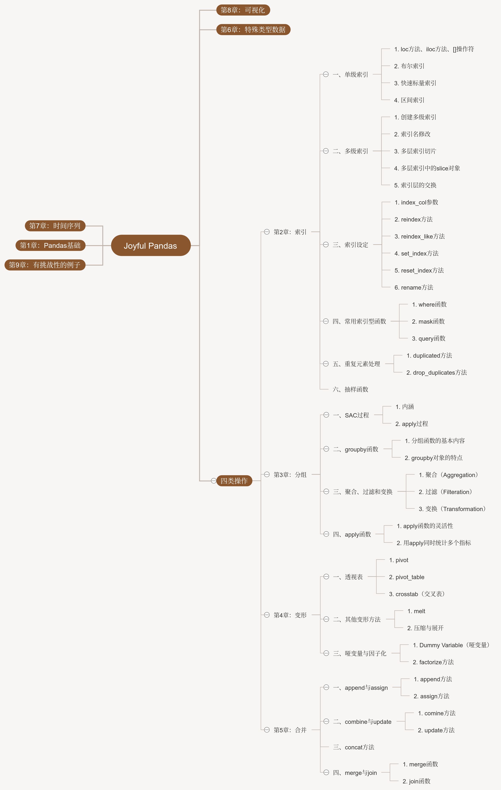

# Joyful-Pandas

#### 一、写作初衷

在使用Pandas之前，几乎所有的大型表格处理问题都是用xlrt和python循环实现，虽然这已经几乎能完成一切的需求，但其缺点也显而易见，其一就是速度问题，其二就是代码的复用性几乎为0。

曾经也尝试过取学Pandas，但不得不说这个包实在太过庞大，每次使用总觉得盲人摸象，每个函数的参数也很多，学习的路线并不是十分平缓。如果你刚刚手上使用Pandas，那么在零碎的学习过程中，报错是常常发生的事，并且很难修（因为不理解内部的操作），即使修好了下次又不会，令人有些沮丧。

上个学期（2019秋季），我偶然找到了一本完全关于Pandas的数，Theodore Petrou所著的Pandas Cookbook，现在可在网上下到pdf，不过现在还没有中文版。寒假开始后，立即快速地过了一遍，发现之前很多搞不清的概念得到了较好的解答，逐步地再对着官方文档一字一句查看，最后总是建立了大的一些宏观概念。

最关键的一步，我想是通读了官方User Guide的绝大部分内容，这可能是非常重要的一个台阶，毕竟官方的教程总是会告诉你重点在哪里。因此，经过了一段时间的思考，结合了Wes Mckinney（Pandas之父）的《利用Python进行数据分析》、先前提到的《Pandas Cookbook》和官方用户指南，由此想按照自己的思路编一套关于Pandas的教程，完整梳理Pandas的主线内容，杜绝浅尝辄止，保证涉及每个部分的核心概念和函数。最后，希望达到的境界自然是“所写所得即所想”，这大概需要更多的实践，也是努力实现的目标方向。

关于项目的名字，我想原先使用Pandas时非常的痛苦（Painful），那现在是时候转变为“Joyful-Pandads”了！

#### 二、编排思路与内容

本项目共有九章，可以大致分为4个板块：

１、拿到数据必然先要读取它，分析完了数据必然是要保存它，读取了数据之后，我们面对了怎样的对象（Series? of Dataframe?）是第一重要的课题，因此了解序列和数据框的常规操作及其组件（component）便是必须涉及的内容。此外，多层标签/索引/列往往会使我们烦躁，这是因为我们还不够了解它，我想看完了第一章，你对这些概念非常熟悉。

２、对于一个DataFrame而言，如果一个操作使得它的元素信息减少了，那就对应了索引，即第二章的内容；如果这个操作使得数据的信息被充分地使用，那有两种可能，第一是数据被分组，从组内提取了关键的信息，第二就是数据呈现的结构或形态上的变化，使得我们更容易地能够地进一步处理数据，这两者分别对应了第三章与第四章的内容；最终如果一个操作使得原本不属于这个数据框的信息被加入了进来，那往往是涉及到了合并操作，对应了第五章的内容。从数据信息增减的角度，拆解成了3个板块，4个章节，几乎串联其了官方文档关于数据框操作的全部内容，我想这样的安排是合适的。

３、如果说前面我们关心了序列和数据框这两种容器的结构和操作，那么下面就要关心其中的元素，特别地，我们将在第六章涉及到分类变量、缺失型变量和文本型变量，第七章涉及到时间序列，第八章涉及到Pandas中的Plot模块（图可以看做元素的某种呈现）。

４、正如前面所说，Pandas的学习往往是任务驱动型，一个操作或者某个方法，不去使用自然会很快地忘记（除非你天赋异禀！），因此我在每一章都会添加“问题和练习”的部分。其中，问题中出现的往往是对于教程中某个细节的深入，或者在这一个章节中重要的函数，希望你能够查阅相关资料阅读以解决问题；而练习部分包含了两个综合题，分别是两个不同的案例，相当于对前面所学知识的考察与综合运用，虽然并不是非常复杂，但是想要全部完成，的确是要动不少脑筋才行。最终，在第9章中会添加若干个我曾经遇到过但解决方案复杂，或者我想到的某一个一时半会儿还没有解决办法的问题，具有一定的挑战性，如果有较好的解决方案，欢迎交流分享，谢谢：）

最后，祝你有所收获！

#### 三、项目导图



#### 四、版本要求

１、Pandas于2020年1月29日发布了1.0.0的版本，本项目全部使用新版本

```
Python: 3.6+
Numpy: 1.17.4
Pandas: 1.0.0
Matplotlib: 3.1.2
```

#### 五、反馈

１、欢迎任何有益的建议或想法，可邮件(1801214626@qq.com)交流！

２、不免有错误，欢迎提Issues！
