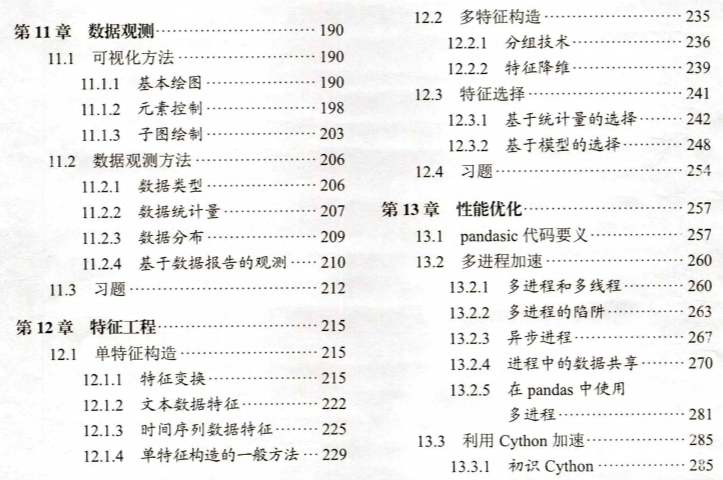
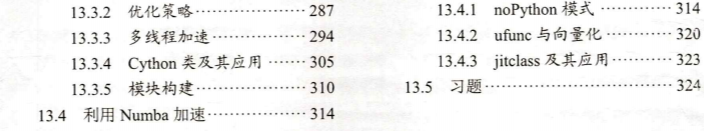

# Joyful-Pandas

## 【好消息！】

基于Joyful Pandas教程编写的纸质版书籍将于七月中旬在各大网络平台上线，欢迎选购（玩命了买！）。本书使用新版的1.4.0，对网页版教程（基于1.2.0）内容作了大量修订，包括内容增改以及习题更新，同时增加了数据可视化、特征工程和性能优化三个章节的内容。本书共计设计练一练121题，章后习题41题，各章节分布与目录见后文。有关本书籍和pandas的任何问题可以在本仓库提issue，或者加最后的二维码进讨论群提问。

在写作期间，Joyful Pandas也被pandas官方增选为[社区推荐教程](https://pandas.pydata.org/docs/dev/getting_started/tutorials.html#joyful-pandas)，在此对pandas核心开发组多年来的长期维护和社区建设表示感谢！

### 纸质版

- 数据集：[下载](https://pan.baidu.com/s/1uE3PcuQ_q8N-ls3rrOqldg)（提取码：9e8r）
- 参考答案：[链接](https://gyhhaha.github.io/pd-book/)
- 练一练与习题

|  章节   | 练一练（题数）  | 习题（\*为纸质版新增） |
|  ----  | ----  | ---- |
| 第一章 预备知识  | 15 | 一、利用列表推导式实现矩阵乘法 二、计算卡方统计量 \* 三、统计某商店的月度销量情况 |
| 第二章 pandas基础  | 8 | \* 一、整理某服装店的商品情况 \* 二、汇总某课程的学生总评分数 三、实现指数加权窗口 |
| 第三章 索引  | 6 | \* 一、实现sample()函数 二、公司员工数据的索引操作 三、巧克力评价数据的索引操作 |
| 第四章 分组  | 10 | 一、汽车数据的分组分析 \* 二、某海洋物种在三大海域的分布研究 三、实现transform()函数 |
| 第五章 变形  | 9 | \* 一、某连锁店的库存统计 \* 二、整理某地区的化石燃料数据 三、特殊的wide_to_long()方法 |
| 第六章 连接 | 5 | 一、合并员工信息表 二、实现join函数 \* 三、条件连接 |
| 第七章 缺失数据  | 6 | \* 一、缺失数据筛选 二、K近邻填充 \* 三、条件近邻插值 |
| 第八章 文本数据  | 3 | 一、房屋数据的文本提取 \* 二、巴洛克作曲家的年龄统计 \* 三、汇总显卡测试的结果 |
| 第九章 分类数据  | 2 | 一、统计未出现的类别 二、钻石数据的类别构造 \* 三、有序类别下的逻辑斯蒂回归 |
| 第十章 时间序列数据  | 10 | 一、太阳辐射数据的时序分析 二、水果销量分析 \* 三、使用Prophet进行时序预测 |
| 第十一章 数据观测 | 15 | \* 一、图片绘制 \* 二、数据观测实战 \* 三、基于PyOD库的异常检测 |
| 第十二章 特征工程 | 12 | \* 一、卡方分箱 \* 二、基于标签的特征构造 \* 三、信用卡诈骗数据的特征工程 |
| 第十三章 性能优化 | 20 | \* 一、DNA链的碱基序列处理 \* 二、捕捉电信号的激活态区间 \* 三、药物靶点的关联性分析 \* 四、物质浓度的指标检测 \* 五、设计滑窗类 |

- 新增的三个章节目录

### 网页版

http://joyfulpandas.datawhale.club/

### 文件内容

* data：网页版教程数据集
* ebook：网页版教程电子版
* notebook：网页版教程notebook

### 参考资料

* [Python for Data Analysis](<https://www.amazon.com/Python-Data-Analysis-Wrangling-IPython/dp/1491957662/ref=sr_1_2?keywords=wes+mckinney&qid=1656348228&sprefix=wes+mc%2Caps%2C107&sr=8-2>) Wes McKinney著

* [Pandas Cookbook](<https://www.amazon.com/Pandas-1-x-Cookbook-scientific-exploratory/dp/1839213108/ref=sr_1_1_sspa?crid=9V843I0IED24&keywords=pandas+cookbook&qid=1656348206&sprefix=pandas+cookbook%2Caps%2C153&sr=8-1-spons&psc=1&spLa=ZW5jcnlwdGVkUXVhbGlmaWVyPUEyVDZUTUUxQ0RFUVRZJmVuY3J5cHRlZElkPUEwNjkzMDczMjdXSFNaM0YzQ1NKRyZlbmNyeXB0ZWRBZElkPUEwNjczNDI3MVFZSTA0M0xWSzZKWiZ3aWRnZXROYW1lPXNwX2F0ZiZhY3Rpb249Y2xpY2tSZWRpcmVjdCZkb05vdExvZ0NsaWNrPXRydWU=>) Theodore Petrou著

* [User Guide](<https://pandas.pydata.org/docs/user_guide/index.html#user-guide>) Pandas开发团队编写

### 交流群

关注Datawhale公众号，回复关键词“熊猫”获得二维码

### LICENSE

</a> 本作品采用<a rel="license" href="http://creativecommons.org/licenses/by-nc-sa/4.0/">知识共享署名-非商业性使用-相同方式共享 4.0 国际许可协议</a>进行许可