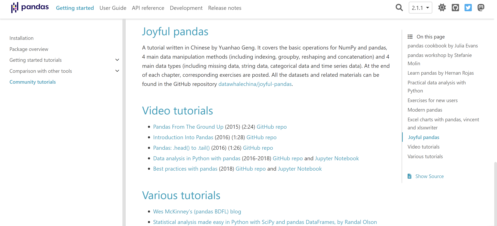
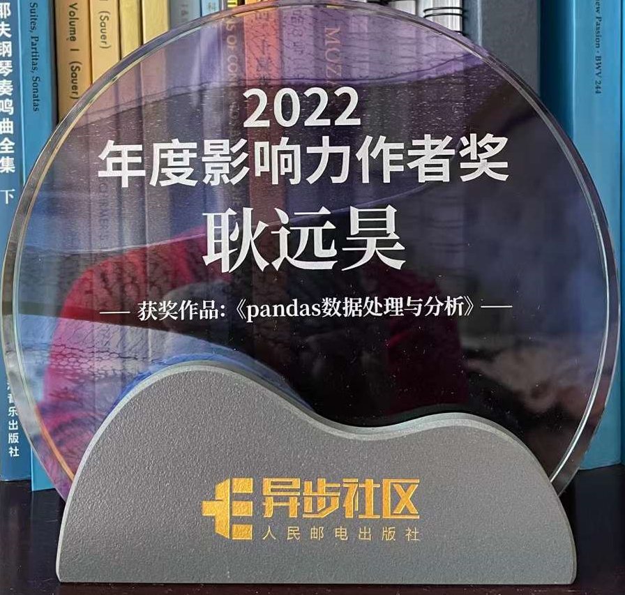
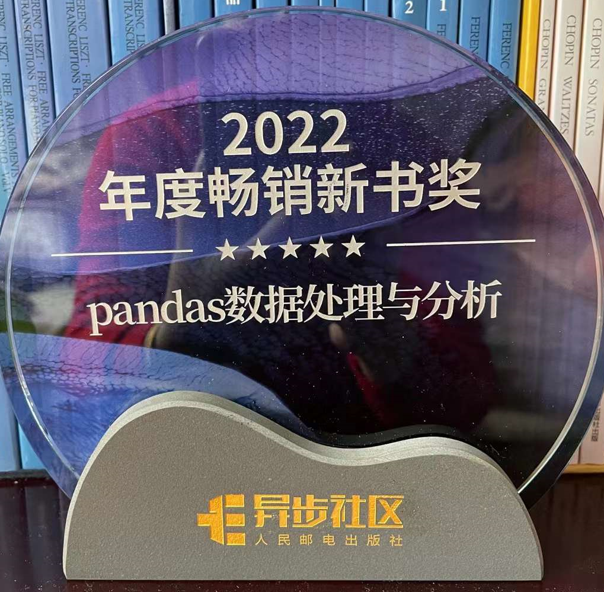

## Introduction

This book is authored by Yuanhao Geng and comprises approximately 325 pages. It focuses on the Python pandas library and covers various data processing and analysis methods. The book is divided into 13 chapters. The first part introduces the basics of Numpy and pandas. The second part covers four types of operations in the pandas library, including indexing, grouping, reshaping, and merging. The third part discusses four types of data in pandas, including missing data, text data, categorical data, and time series data, along with methods to handle these data types. The fourth part delves into topics related to data observation, feature engineering, and performance optimization.

The book is characterized by rich exercises. Each chapter ends with exercises, and there are numerous exercises throughout the book. Readers can apply their macroscopic understanding of data science through these exercises. This book is suitable for practitioners or researchers in the field of data science who have a certain foundation in Python programming and want to use pandas for data processing and analysis.

## Open Source Contributions

During the writing process, Yuanhao Geng actively contributed to the open-source development of the pandas library. He participated in the contributions for all minor versions from 1.0 to 2.0, with nearly 30 pull requests merged by the official team. His contributions included bug fixes, code performance optimizations, and the implementation of function operators. See [here](https://github.com/pandas-dev/pandas/pulls?q=is%3Apr+author%3AGYHHAHA+is%3Aclosed) for whole list of his contribution and [here](https://pandas.pydata.org/docs/search.html?q=yuanhao) for the logs of pandas minor release contributors.

## Awards and Recognitions

This book has been recognized as the sole official recommended Chinese tutorial on the pandas official website. It also holds the top position in the rating list of similar books on [Douban](https://book.douban.com/subject/35998391/), China's largest book rating website, with a score of 9.2 out of 10. Readers have widely praised the book.

In 2022, Yuanhao Geng was awarded the Influential Author Award and the Bestselling Book Award by the Posts & Telecom Press due to the success of this book.

